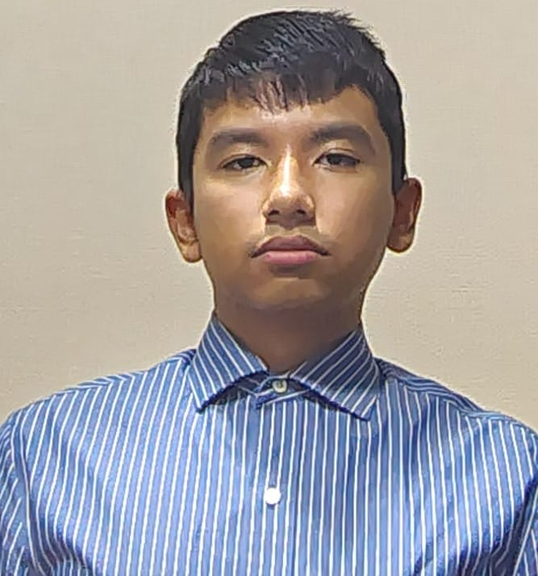
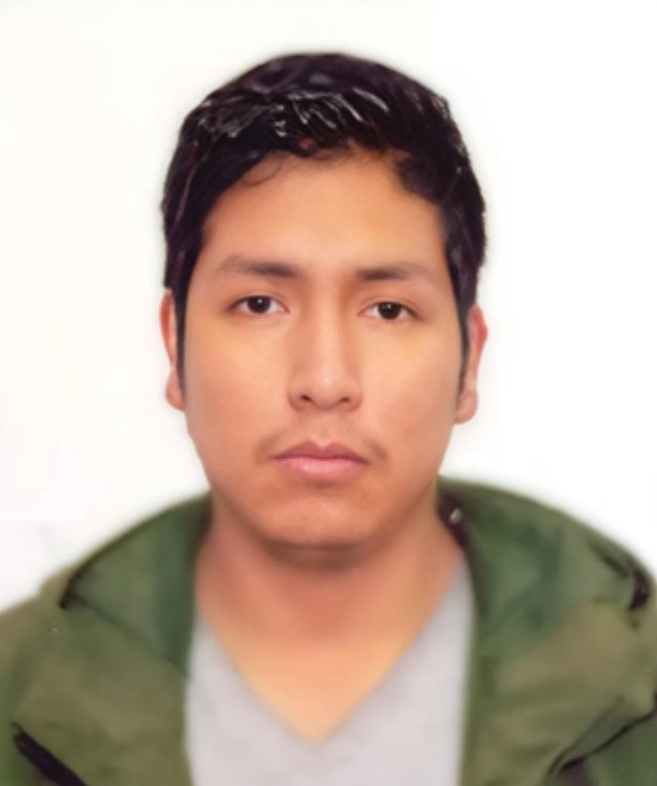
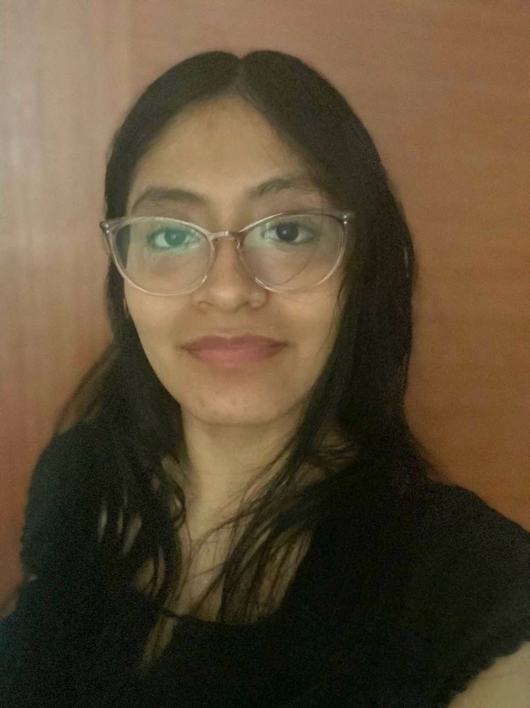

# Capítulo I: Introducción

## 1.1. Startup Profile

### 1.1.1 Descripción de la Startup

Somos un equipo recientemente formado enfocado en desarrollar una solución tecnológica que responda a una necesidad real: mejorar el cuidado y la seguridad de los recién nacidos, ayudando a detectar a tiempo posibles señales de alerta que muchas veces pasan desapercibidas.

### 1.1.2 Perfiles de integrantes del equipo
| Foto | Apellido y nombre | Código | Carrera | Acerca de |
|------|------------------|--------|----------|------------|
|  | Retuerto Rodríguez, Jorge Manuel | u202318612 | Ingeniería de Software | Mi nombre es Jorge Manuel Retuerto Rodríguez, tengo 20 años y estoy cursando el 6to ciclo de la carrera de Ingeniería de Software en la Universidad Peruana de Ciencias Aplicadas. Mi conocimiento y habilidades de programación son intermedias en C++, C#, HTML y CSS. Sin embargo, básicas en Python y Java. Me haré responsable de la comunicación del grupo, planificación y desarrollo junto a mi equipo. |
|  | Said Conde, Yazid | u202312348 | Ingeniería de Software | Me considero una persona responsable al momento de trabajar en equipo, siempre proactivo y dispuesto a tomar las riendas en situaciones críticas. Me encanta programar y todo el área de desarrollo de software, desarrollo de videojuegos y ciberseguridad en el área de Red Team. Tengo conocimientos en Python, SQL, C++, desarrollo web. Mis conocimientos serán de gran ayuda en el desarrollo del proyecto. |
|  | Daril Johan Palomino Vilcañaupa | u202317338 | Ingeniería de Software | Soy estudiante de Ingeniería de Software en la UPC. Me considero una persona perseverante y constante, siempre enfocada en superarme día a día para afrontar nuevos desafíos con determinación. Me caracterizo por ser empático y saber trabajar con los demás. Además, disfruto practicar deportes y mantengo un fuerte compromiso con el proyecto y mis objetivos académicos. |
|  | Mariel Lucero Mendoza Moreano | u20231a418 | Ingeniería de Software | Mi nombre es Mariel Lucero Mendoza Moreano, tengo 20 años y actualmente estudio Ingeniería de Software en la Universidad de Ciencias Aplicadas. Cuento con conocimientos en HTML, CSS y C++, los cuales he ido desarrollando a través de mis estudios y proyectos académicos. Me considero una persona responsable, proactiva y con disposición para colaborar y brindar apoyo cuando se requiere. Además, me interesa aprender constantemente nuevas tecnologías y mejorar mis habilidades para aportar de manera efectiva en proyectos de desarrollo de software. |
|  | Diego Alonso Véliz Martínez | u20211b564 | Ingeniería de Software | Mi nombre es Diego Alonso Véliz Martínez, tengo 20 años y curso el sexto ciclo de Ingeniería de Software en la Universidad Peruana de Ciencias Aplicadas. Tengo nivel intermedio en C++, C#, HTML y CSS, y básico en Python y Java. Seré responsable de la comunicación, planificación y desarrollo del proyecto junto a mi equipo. Me considero proactivo, responsable y con iniciativa para liderar en situaciones críticas. Me apasiona el desarrollo de software, especialmente en videojuegos y ciberseguridad, y mis conocimientos en programación y desarrollo web aportarán al éxito del proyecto. |
## 1.2 Solution Profile

### 1.2.1 Antecedentes y problemática

### 1.2.2 Lean UX Process

#### 1.2.2.1. Lean UX Problem Statements

#### 1.2.2.2. Lean UX Assumptions

#### 1.2.2.3. Lean UX Hypothesis Statements

#### 1.2.2.4. Lean UX Canvas

## 1.3. Segmentos objetivo