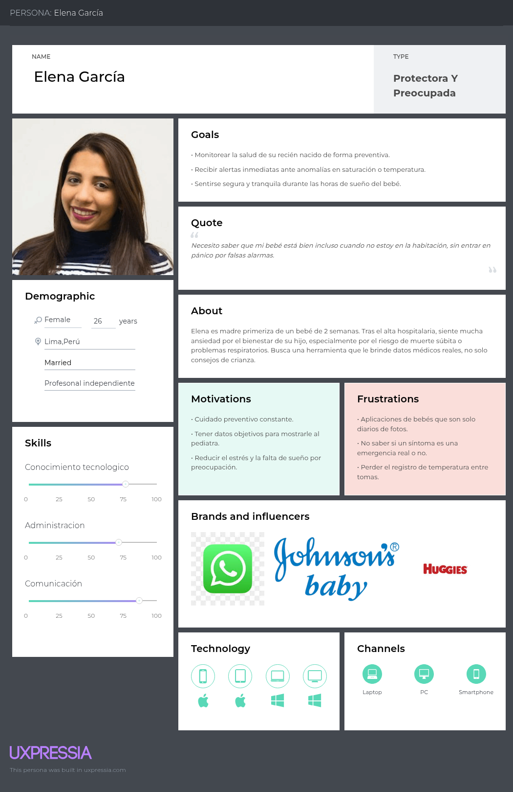
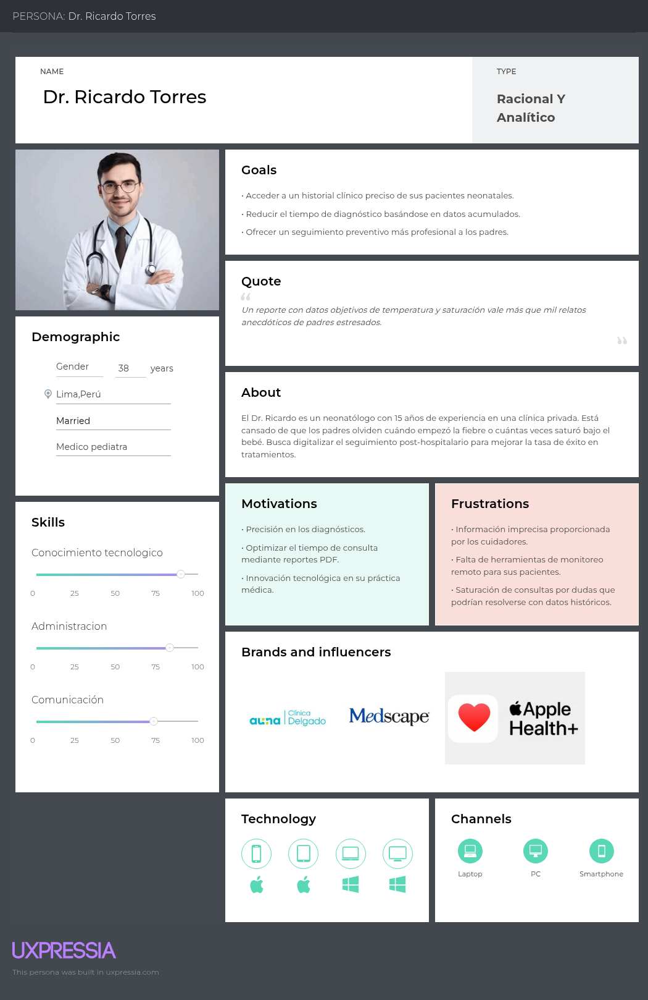

# Capítulo II: Requirements Elicitation & Analysis

## 2.1. Competidores

### 2.1.1. Análisis competitivo

<table>
  <tr>
    <th colspan="6" valign="top">Competitive Analysis Landscape</th>
  </tr>
  <tr>
    <td colspan="2" valign="top">¿Por qué llevar a cabo este análisis?</td>
    <td colspan="4" valign="top">El objetivo de este análisis es identificar las características de los competidores en el monitoreo neonatal y encontrar maneras de diferenciar a SIRAN mediante la precisión clínica y la conexión directa médico-padre.</td>
  </tr>
  <tr>
    <td colspan="2" rowspan="2" valign="top">Startup y Competidores</td>
    <td valign="top">Nuestra Startup</td>
    <td valign="top">Baby+ (Philips Avent)</td>
    <td valign="top">Huckleberry</td>
    <td valign="top">Glow Baby</td>
  </tr>
  <tr>
    <td valign="top"><b>SIRAN</b></td>
    <td valign="top"><b>Baby+</b></td>
    <td valign="top"><b>Huckleberry</b></td>
    <td valign="top"><b>Glow Baby</b></td>
   </tr>
  <tr>
    <td rowspan="2" valign="top">Perfil</td>
    <td valign="top">Overview</td>
    <td valign="top">Sistema inteligente de registro y alerta neonatal diseñado para el monitoreo clínico preventivo y la detección temprana de anomalías fisiológicas en recién nacidos.</td>
    <td valign="top">Aplicación integral de seguimiento del desarrollo del bebé respaldada por una marca líder global en puericultura.</td>
    <td valign="top">App especializada en la gestión del sueño y rutinas del bebé mediante algoritmos predictivos de descanso.</td>
    <td valign="top">Plataforma de registro colaborativo con un fuerte enfoque en comunidad y apoyo entre padres jóvenes.</td>
  </tr>
  <tr>
    <td valign="top">Ventaja competitiva ¿Qué valor ofrece a los clientes?</td>
    <td valign="top">Alertas basadas en parámetros médicos reales, reportes técnicos exportables para pediatras y reducción de fatiga por falsas alarmas.</td>
    <td valign="top">Respaldo de marca Philips, guías de expertos y herramientas visuales de hitos del desarrollo físico.</td>
    <td valign="top">Algoritmo de sueño de alta precisión que predice la "ventana de sueño" ideal del neonato.</td>
    <td valign="top">Sincronización en la nube para múltiples cuidadores (padres, abuelos, nannies) y comunidad activa.</td>
  </tr>
  <tr>
    <td rowspan="2" valign="top">Perfil de Marketing</td>
    <td valign="top">Mercado objetivo</td>
    <td valign="top">Padres que requieren monitoreo clínico preventivo, clínicas neonatales y pediatras particulares que buscan datos objetivos.</td>
    <td valign="top">Padres primerizos que buscan una solución integral de una marca de confianza tradicional.</td>
    <td valign="top">Padres preocupados específicamente por los hábitos de sueño y la organización de rutinas diarias.</td>
    <td valign="top">Padres jóvenes y digitales que valoran la interacción social y el registro compartido simple.</td>
  </tr>
  <tr>
    <td valign="top">Estrategias de marketing</td>
    <td valign="top">Alianzas con centros de salud (B2B), marketing de contenido sobre salud neonatal especializada y demostraciones de precisión clínica.</td>
    <td valign="top">SEO agresivo, branding de marca global y paquetes con productos físicos (biberones, monitores).</td>
    <td valign="top">Influencer marketing, pruebas gratuitas de la versión Premium y enfoque en "bienestar familiar".</td>
    <td valign="top">Publicidad en redes sociales, gamificación del registro diario y marketing de comunidad.</td>
  </tr>
  <tr>
    <td rowspan="3" valign="top">Perfil de Producto</td>
    <td valign="top">Productos & Servicios</td>
    <td valign="top">Registro de signos vitales, motor de alertas inteligentes, reportes médicos PDF, acceso multiplataforma sincronizado.</td>
    <td valign="top">Diario de alimentación, seguimiento de hitos, artículos de expertos, álbum de fotos digital.</td>
    <td valign="top">Análisis de sueño, recordatorios de rutinas, asesoría de sueño personalizada (Plan Premium).</td>
    <td valign="top">Registro de pañales y comidas, foro comunitario, seguimiento gráfico de crecimiento.</td>
  </tr>
  <tr>
    <td valign="top">Precios & Costos</td>
    <td valign="top">SaaS con suscripción mensual para padres; planes de licenciamiento por volumen para clínicas neonatales.</td>
    <td valign="top">Gratuito (Modelo Freemium con venta de productos físicos adicionales).</td>
    <td valign="top">Suscripción Premium (aprox. $15 USD mensuales).</td>
    <td valign="top">Freemium con publicidad o suscripción mensual para eliminar anuncios.</td>
  </tr>
  <tr>
    <td valign="top">Canales de distribución (Web y/o Móvil)</td>
    <td valign="top">Web responsive para PC y tablets, aplicación móvil nativa. Integración con APIs de gestión hospitalaria.</td>
    <td valign="top">Aplicación móvil (App Store y Google Play).</td>
    <td valign="top">Aplicación móvil (App Store y Google Play).</td>
    <td valign="top">Aplicación móvil (App Store y Google Play).</td>
  </tr>
  <tr>
    <td rowspan="4" valign="top">Análisis SWOT</td>
    <td valign="top">Fortalezas</td>
    <td valign="top">Enfoque clínico especializado, interoperabilidad con médicos, diseño centrado en la tranquilidad basada en datos.</td>
    <td valign="top">Gran base de usuarios instalada, contenido educativo de alta calidad avalado.</td>
    <td valign="top">Especialización única en sueño, alta retención de usuarios por efectividad del algoritmo.</td>
    <td valign="top">Fuerte sentido de comunidad, facilidad de uso colaborativo entre varios usuarios.</td>
  </tr>
  <tr>
    <td valign="top">Debilidades</td>
    <td valign="top">Etapa inicial de desarrollo, necesidad de validación clínica rigurosa y permisos sanitarios.</td>
    <td valign="top">Enfoque muy generalista, no diseñado para detectar emergencias médicas críticas.</td>
    <td valign="top">Enfoque limitado casi exclusivamente a rutinas, la interfaz puede ser abrumadora para el registro.</td>
    <td valign="top">Exceso de publicidad en versión gratuita, preocupaciones de privacidad en la comunidad.</td>
  </tr>
  <tr>
    <td valign="top">Oportunidades</td>
    <td valign="top">Alianzas con seguros de salud privados y expansión a servicios de telemedicina neonatal directa.</td>
    <td valign="top">Integración con hardware IoT propio (monitores de respiración inteligentes).</td>
    <td valign="top">Expandirse a otros problemas de comportamiento infantil y nutrición temprana.</td>
    <td valign="top">Monetización mediante un marketplace integrado de productos para bebés.</td>
  </tr>
  <tr>
    <td valign="top">Amenazas</td>
    <td valign="top">Regulaciones estrictas de datos de salud sensible, competencia de dispositivos wearables médicos certificados.</td>
    <td valign="top">Nuevas aplicaciones hiper-especializadas que fragmenten su mercado masivo.</td>
    <td valign="top">Cambios en políticas de privacidad de las tiendas de aplicaciones (Apple/Google).</td>
    <td valign="top">Migración de usuarios a grupos de redes sociales gratuitos con funciones similares.</td>
  </tr>
  <tr>
    <td rowspan="2" valign="top">Precios y costos</td>
    <td valign="top">Costo Anual</td>
    <td valign="top">Desde S/ 540* (Suscripción Pro)</td>
    <td valign="top">Gratis / Freemium</td>
    <td valign="top">~$180 USD (~S/ 680)</td>
    <td valign="top">Gratis / $60 USD suscripción</td>
  </tr>
  <tr>
    <td valign="top">Mensual</td>
    <td valign="top">Desde S/ 45</td>
    <td valign="top">S/ 0</td>
    <td valign="top">~$15 USD (~S/ 57)</td>
    <td valign="top">S/ 0 / $8.99 USD</td>
  </tr>
</table>

### 2.1.2. Estrategias y tácticas frente a competidores

**Estrategias**

  - Diferenciarnos por precisión clínica y detección preventiva, enfocándonos en parámetros de salud (temperatura, hidratación, ictericia) que las apps comerciales ignoran.
  - Establecer un puente de información médica, permitiendo que SIRAN sea una herramienta de apoyo real para el pediatra con datos objetivos, no solo un diario anecdótico.
  - Priorizar la salud mental de los padres mediante un sistema de alertas inteligentes que reduzca la ansiedad y evite la fatiga por notificaciones irrelevantes o falsas.

  ---

 **Tácticas**

  - Desarrollar un módulo de exportación de reportes clínicos en formato PDF estructurado, diseñado para ser revisado por un médico en menos de 2 minutos durante la consulta.
  - Implementar un algoritmo de triaje inteligente que categorice las alertas en niveles (Informativo, Atención, Urgente) basado en protocolos neonatales estándar.
  - Crear una interfaz de "Modo Noche" y diseño visual minimalista que promueva la calma y sea extremadamente fácil de operar durante las madrugadas.
  - Ofrecer una guía de integración para personal médico, facilitando que los pediatras recomienden SIRAN como parte oficial de su protocolo de seguimiento preventivo.

## 2.2. Entrevistas

### 2.2.1. Diseño de entrevistas

### 2.1.2. Estrategias y tácticas frente a competidores

## 2.2. Entrevistas

### 2.2.1. Diseño de entrevistas

### 2.2.2. Registro de entrevistas

### 2.2.3. Análisis de entrevistas

## 2.3. Needfinding

### 2.3.1. User Personas

**Padres Primerizos**

**Medico Pediatra**

### 2.3.2. User Task Matrix

### 2.3.3. User Journey Mapping

### 2.3.4. Empathy Mapping

### 2.4. Big Picture Event Storming

### 2.5. Ubiquitous Language