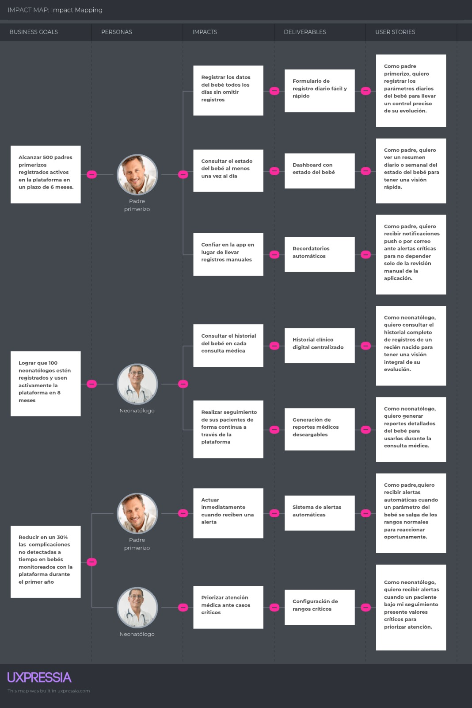
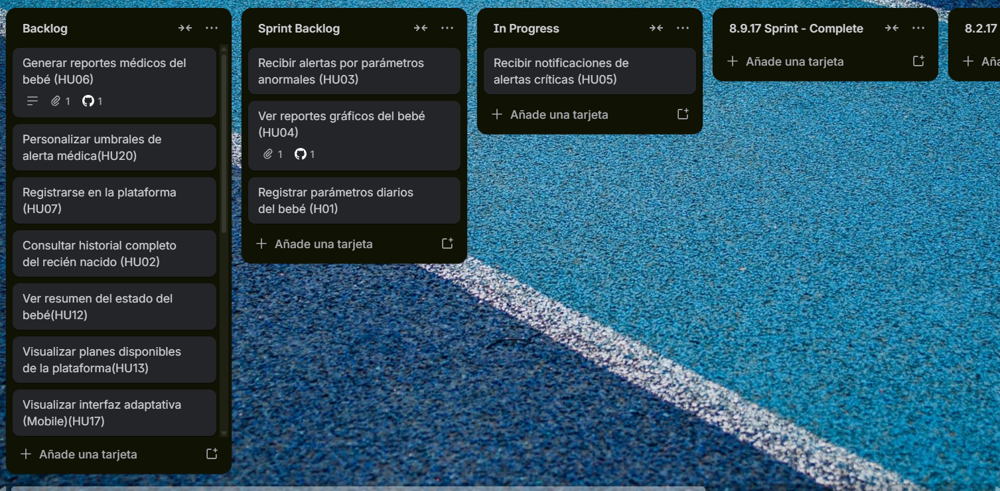

# Capítulo III: Requirements Specification

## 3.1. User Stories

- **Epics**

<table border="1" style="border-collapse:collapse">
  <thead>
    <tr>
      <th>EPIC ID</th>
      <th>Titulo</th>
      <th>Descripcion</th>
    </tr>
  </thead>
  <tbody>
    <tr>
      <td>EP01</td>
      <td>Gestión y Monitoreo de Datos Neonatales</td>
      <td>Como padre o neonatólogo, quiero registrar y consultar información del recién nacido para llevar un control detallado de su evolución y seguimiento clínico.</td>
    </tr>
    <tr>
      <td>EP02</td>
      <td>Alertas Inteligentes y Notificaciones</td>
      <td>Como padre o neonatólogo, quiero recibir alertas y notificaciones sobre valores críticos del bebé para reaccionar oportunamente y priorizar la atención médica.</td>
    </tr>
    <tr>
      <td>EP03</td>
      <td>Análisis y Reportes</td>
      <td>Como padre o neonatólogo, quiero visualizar reportes y resúmenes del estado del bebé para comprender su evolución y apoyar la toma de decisiones.</td>
    </tr>
    <tr>
      <td>EP04</td>
      <td>Gestión de Cuenta</td>
      <td>Como padre o neonatólogo, quiero gestionar mi cuenta en la plataforma para acceder de manera segura a las funcionalidades del sistema.</td>
    </tr>
    <tr>
      <td>EP05</td>
      <td>Captación y Presentación de la Plataforma</td>
      <td>Como visitante, quiero conocer la plataforma y sus beneficios para evaluar su utilidad y decidir si registrarme.</td>
    </tr>
    <tr>
      <td>EP06</td>
      <td>Documentación Técnica y Marco Estratégico del Proyecto</td>
      <td>Como developer, quiero definir y documentar el modelo de negocio, requisitos y diseño del sistema para guiar el desarrollo del producto de manera estructurada.</td>
    </tr>
  </tbody>
</table>

- **User Stories**

<table border="1" style="border-collapse:collapse">
  <thead>
    <tr>
      <th>STORY ID</th>
      <th>Titulo</th>
      <th>Descripcion</th>
      <th>Criterios de aceptacion</th>
      <th>EPIC ID</th>
    </tr>
  </thead>
  <tbody>
    <tr>
      <td>HU01</td>
      <td>Registrar parámetros diarios del bebé</td>
      <td>Como padre, quiero registrar los parámetros diarios del bebé para llevar un control preciso de su evolución.</td>
      <td><strong>Escenario 1:</strong> Registro correcto (almacena datos con fecha/hora).  <strong>Escenario 2:</strong> Datos incompletos (el sistema rechaza el registro).</td>
      <td>EP01</td>
    </tr>
    <tr>
      <td>HU02</td>
      <td>Consultar historial completo del recién nacido</td>
      <td>Como neonatólogo, quiero consultar el historial completo de registros de un recién nacido.</td>
      <td><strong>Escenario 1:</strong> Muestra datos cronológicamente.  <strong>Escenario 2:</strong> Filtros por parámetro o rango de fechas.</td>
      <td>EP01</td>
    </tr>
    <tr>
      <td>HU03</td>
      <td>Recibir alertas por parámetros anormales</td>
      <td>Como padre, quiero recibir alertas automáticas cuando un parámetro se salga de los rangos normales.</td>
      <td><strong>Escenario 1:</strong> Generación de alerta.  <strong>Escenario 2:</strong> Visualización con prioridad.  <strong>Escenario 3:</strong> No alerta si el dato es normal.</td>
      <td>EP02</td>
    </tr>
    <tr>
      <td>HU04</td>
      <td>Ver reportes gráficos del bebé</td>
      <td>Como padre, quiero visualizar reportes gráficos de la evolución del bebé.</td>
      <td><strong>Escenario 1:</strong> Generación de gráficos (temp, peso, etc).  <strong>Escenario 2:</strong> Exportación de reporte.  <strong>Escenario 3:</strong> Sin datos suficientes.</td>
      <td>EP03</td>
    </tr>
    <tr>
      <td>HU05</td>
      <td>Recibir notificaciones de alertas críticas</td>
      <td>Como padre, quiero recibir notificaciones push o correo ante alertas críticas.</td>
      <td><strong>Escenario 1:</strong> Envío en &lt;60 seg.  <strong>Escenario 2:</strong> Acceso directo al detalle desde la notificación.</td>
      <td>EP02</td>
    </tr>
    <tr>
      <td>HU06</td>
      <td>Generar reportes médicos del bebé</td>
      <td>Como neonatólogo, quiero generar reportes detallados para la consulta médica.</td>
      <td><strong>Escenario 1:</strong> Documento con tendencias y alertas.  <strong>Escenario 2:</strong> Envío por correo o guardado.</td>
      <td>EP03</td>
    </tr>
    <tr>
      <td>HU07</td>
      <td>Registrarse en la plataforma</td>
      <td>Como padre o neonatólogo, quiero registrarme en la plataforma.</td>
      <td><strong>Escenario 1:</strong> Registro válido.  <strong>Escenario 2:</strong> Correo repetido (error).  <strong>Escenario 3:</strong> Datos incompletos (error).</td>
      <td>EP04</td>
    </tr>
    <tr>
      <td>HU08</td>
      <td>Iniciar sesión en la plataforma</td>
      <td>Como usuario registrado, quiero iniciar sesión en la plataforma.</td>
      <td><strong>Escenario 1:</strong> Acceso válido.  <strong>Escenario 2:</strong> Credenciales incorrectas (denegado).  <strong>Escenario 3:</strong> Bloqueo temporal por intentos fallidos.</td>
      <td>EP04</td>
    </tr>
    <tr>
      <td>HU09</td>
      <td>Visualizar beneficios de la plataforma</td>
      <td>Como visitante, quiero conocer los beneficios principales de SIRAN.</td>
      <td><strong>Escenario 1:</strong> Vista de beneficios.  <strong>Escenario 2:</strong> Opción de inicio de registro.</td>
      <td>EP05</td>
    </tr>
    <tr>
      <td>HU10</td>
      <td>Cerrar sesión en la plataforma</td>
      <td>Como usuario autenticado, quiero cerrar mi sesión.</td>
      <td><strong>Escenario 1:</strong> Finalización de sesión.  <strong>Escenario 2:</strong> Protección de datos tras cierre.</td>
      <td>EP04</td>
    </tr>
    <tr>
      <td>HU11</td>
      <td>Visualizar testimonios y casos de uso</td>
      <td>Como visitante, quiero ver testimonios reales para generar confianza.</td>
      <td><strong>Escenario 1:</strong> Testimonios segmentados (padres/médicos).  <strong>Escenario 2:</strong> Identificación clara de segmentos.</td>
      <td>EP05</td>
    </tr>
    <tr>
      <td>HU12</td>
      <td>Ver resumen del estado del bebé</td>
      <td>Como padre, quiero ver un resumen diario o semanal.</td>
      <td><strong>Escenario 1:</strong> Promedios y destacados.  <strong>Escenario 2:</strong> Inclusión de alertas importantes.</td>
      <td>EP05</td>
    </tr>
    <tr>
      <td>HU13</td>
      <td>Visualizar planes disponibles</td>
      <td>Como visitante, quiero visualizar los planes de suscripción.</td>
      <td><strong>Escenario 1:</strong> Visualización de planes y precios.  <strong>Escenario 2:</strong> Selección de plan.  <strong>Escenario 3:</strong> Acceso a pago.</td>
      <td>EP05</td>
    </tr>
    <tr>
      <td>HU14</td>
      <td>Recibir alertas de pacientes con valores críticos</td>
      <td>Como neonatólogo, quiero recibir alertas de mis pacientes.</td>
      <td><strong>Escenario 1:</strong> Notificación por valor crítico.  <strong>Escenario 2:</strong> Comentario tras revisión de alerta.</td>
      <td>EP02</td>
    </tr>
    <tr>
      <td>HU15</td>
      <td>Registrar observaciones y síntomas</td>
      <td>Como usuario, quiero registrar síntomas u observaciones cualitativas.</td>
      <td><strong>Escenario 1:</strong> Guardado de observación.  <strong>Escenario 2:</strong> Visualización histórica de observaciones.</td>
      <td>EP01</td>
    </tr>
    <tr>
      <td>HU16</td>
      <td>Revisar y marcar observaciones del bebé</td>
      <td>Como neonatólogo, quiero revisar y marcar observaciones.</td>
      <td><strong>Escenario 1:</strong> Ordenamiento por filtro.  <strong>Escenario 2:</strong> Cambio de estado (revisada).</td>
      <td>EP01</td>
    </tr>
    <tr>
      <td>HU17</td>
      <td>Visualizar interfaz adaptativa</td>
      <td>Como visitante, quiero una interfaz que se adapte a dispositivos móviles.</td>
      <td><strong>Escenario 1:</strong> Navegación móvil (hamburguesa).  <strong>Escenario 2:</strong> Ajuste fluido al rotar pantalla.</td>
      <td>EP05</td>
    </tr>
    <tr>
      <td>HU18</td>
      <td>Cambiar idioma de la plataforma</td>
      <td>Como visitante extranjero, quiero cambiar el idioma.</td>
      <td><strong>Escenario 1:</strong> Traducción instantánea.  <strong>Escenario 2:</strong> Persistencia de idioma.</td>
      <td>EP05</td>
    </tr>
    <tr>
      <td>HU19</td>
      <td>Navegación por anclas</td>
      <td>Como visitante, quiero navegar por las secciones del menú.</td>
      <td><strong>Escenario 1:</strong> Desplazamiento suave.  <strong>Escenario 2:</strong> Redirección a inicio ante error.</td>
      <td>EP05</td>
    </tr>
    <tr>
      <td>HU20</td>
      <td>Personalizar umbrales de alerta médica</td>
      <td>Como neonatólogo, quiero ajustar rangos por paciente.</td>
      <td><strong>Escenario 1:</strong> Aplicación de nuevos límites.  <strong>Escenario 2:</strong> Validación de valores inconsistentes.</td>
      <td>EP02</td>
    </tr>
  </tbody>
</table>

- **Technical Stories**

<table border="1" style="border-collapse:collapse">
  <thead>
    <tr>
      <th>STORY ID</th>
      <th>Titulo</th>
      <th>Descripcion</th>
      <th>Criterios de aceptacion</th>
      <th>EPIC ID</th>
    </tr>
  </thead>
  <tbody>
    <tr>
      <td>TS01</td>
      <td>API de registro de datos del bebé</td>
      <td>Como Developer, quiero implementar un endpoint para registrar los datos del bebé para almacenar información clínica.</td>
      <td><strong>Escenario 1:</strong> Registro exitoso (POST válido, almacena y retorna confirmación).  <strong>Escenario 2:</strong> Datos inválidos (POST incompleto/incorrecto, retorna error).</td>
      <td>EP01</td>
    </tr>
    <tr>
      <td>TS02</td>
      <td>API de consulta de historial del bebé</td>
      <td>Como Developer, quiero implementar un endpoint para obtener el historial de registros del bebé.</td>
      <td><strong>Escenario 1:</strong> Consulta exitosa (GET válido, retorna registros ordenados).  <strong>Escenario 2:</strong> Bebé no encontrado (GET inexistente, retorna error).</td>
      <td>EP01</td>
    </tr>
    <tr>
      <td>TS03</td>
      <td>Lógica de generación de alertas</td>
      <td>Como Developer, quiero implementar la lógica de alertas basada en parámetros para detectar valores fuera de rango.</td>
      <td><strong>Escenario 1:</strong> Generación de alerta (valor excede umbral).  <strong>Escenario 2:</strong> Valor dentro de rango (no genera alerta).</td>
      <td>EP02</td>
    </tr>
    <tr>
      <td>TS04</td>
      <td>API de consulta de alertas generadas</td>
      <td>Como Developer, quiero implementar un endpoint para consultar las alertas generadas.</td>
      <td><strong>Escenario 1:</strong> Consulta exitosa (retorna lista de alertas).  <strong>Escenario 2:</strong> Sin alertas (retorna lista vacía).</td>
      <td>EP02</td>
    </tr>
    <tr>
      <td>TS05</td>
      <td>API de generación de reportes del bebé</td>
      <td>Como Developer, quiero implementar un endpoint para generar reportes para el análisis de evolución.</td>
      <td><strong>Escenario 1:</strong> Generación exitosa (resumen de tendencias).  <strong>Escenario 2:</strong> Datos insuficientes (retorna error).</td>
      <td>EP03</td>
    </tr>
    <tr>
      <td>TS06</td>
      <td>Definición de Modelo de Negocio y alcance</td>
      <td>Como Developer quiero definir el modelo de negocio y alcance del proyecto SIRAN.</td>
      <td><strong>Escenario 1:</strong> Validación de Business/Customer Assumptions.  <strong>Escenario 2:</strong> Especificación de ingresos e indicadores.  <strong>Escenario 3:</strong> Alcance funcional y no funcional.</td>
      <td>EP06</td>
    </tr>
    <tr>
      <td>TS07</td>
      <td>Análisis de Necesidades y Realidad del Usuario</td>
      <td>Como Developer, quiero documentar las necesidades para tener claridad antes de diseñar la arquitectura.</td>
      <td><strong>Escenario 1:</strong> Documentación de 5W's, 2H's y Problem Statement.  <strong>Escenario 2:</strong> Necesidades específicas por segmento.</td>
      <td>EP06</td>
    </tr>
    <tr>
      <td>TS08</td>
      <td>Especificación de Requisitos</td>
      <td>Como Developer, quiero especificar los requisitos funcionales y no funcionales.</td>
      <td><strong>Escenario 1:</strong> User Stories con criterios de aceptación.  <strong>Escenario 2:</strong> Requisitos no funcionales (seguridad, rendimiento, etc).</td>
      <td>EP06</td>
    </tr>
    <tr>
      <td>TS09</td>
      <td>Diseño de Producto</td>
      <td>Como Developer, quiero diseñar la arquitectura y experiencia antes de la implementación.</td>
      <td><strong>Escenario 1:</strong> Documentación de arquitectura y componentes.  <strong>Escenario 2:</strong> Prototipos o wireframes.</td>
      <td>EP06</td>
    </tr>
    <tr>
      <td>TS10</td>
      <td>Implementación, Validación y Deploy</td>
      <td>Como Developer, quiero implementar, validar y desplegar el sistema.</td>
      <td><strong>Escenario 1:</strong> Implementación de funcionalidades según prioridades.  <strong>Escenario 2:</strong> Verificación mediante pruebas funcionales.</td>
      <td>EP06</td>
    </tr>
  </tbody>
</table>

## 3.2. Impact Mapping

## 3.3. Product Backlog

El siguiente Product Backlog presenta la priorización de las User Stories del sistema SIRAN, organizadas en función del valor que aportan al negocio. Se incluyen las historias relacionadas con la Plataforma Web Informativa (Landing Page) para validar la propuesta de valor del producto y atraer usuarios desde etapas tempranas. Seguidamente se priorizan las funcionalidades clave del sistema relacionadas con el monitoreo del bebé, generación de alertas y análisis de datos. Finalmente, se consideran las historias asociadas a la gestión de cuentas, dado que no representan el mayor valor inicial para el usuario. 

<table border="1" style="border-collapse: collapse">
  <thead>
    <tr>
      <th>ID</th>
      <th>Título</th>
      <th>Estimación (Esfuerzo)</th>
    </tr>
  </thead>
  <tbody>
    <tr>
      <td>HU07</td>
      <td>Registrarse en la plataforma</td>
      <td>3</td>
    </tr>
    <tr>
      <td>HU08</td>
      <td>Iniciar sesión en la plataforma</td>
      <td>2</td>
    </tr>
    <tr>
      <td>HU01</td>
      <td>Registrar parámetros diarios del bebé</td>
      <td>5</td>
    </tr>
    <tr>
      <td>HU02</td>
      <td>Consultar historial completo del recién nacido</td>
      <td>3</td>
    </tr>
    <tr>
      <td>HU03</td>
      <td>Recibir alertas por parámetros anormales</td>
      <td>8</td>
    </tr>
    <tr>
      <td>HU14</td>
      <td>Recibir alertas de pacientes con valores críticos</td>
      <td>5</td>
    </tr>
    <tr>
      <td>HU05</td>
      <td>Recibir notificaciones de alertas críticas</td>
      <td>5</td>
    </tr>
    <tr>
      <td>HU04</td>
      <td>Ver reportes gráficos del bebé</td>
      <td>8</td>
    </tr>
    <tr>
      <td>HU06</td>
      <td>Generar reportes médicos del bebé</td>
      <td>5</td>
    </tr>
    <tr>
      <td>HU15</td>
      <td>Registrar observaciones y síntomas del bebé</td>
      <td>2</td>
    </tr>
    <tr>
      <td>HU16</td>
      <td>Revisar y marcar observaciones del bebé</td>
      <td>2</td>
    </tr>
    <tr>
      <td>HU12</td>
      <td>Ver resumen del estado del bebé</td>
      <td>3</td>
    </tr>
    <tr>
      <td>HU20</td>
      <td>Personalizar umbrales de alerta médica</td>
      <td>5</td>
    </tr>
    <tr>
      <td>HU10</td>
      <td>Cerrar sesión en la plataforma</td>
      <td>1</td>
    </tr>
    <tr>
      <td>HU09</td>
      <td>Visualizar beneficios de la plataforma (Landing)</td>
      <td>2</td>
    </tr>
    <tr>
      <td>HU11</td>
      <td>Visualizar testimonios y casos de uso</td>
      <td>2</td>
    </tr>
    <tr>
      <td>HU13</td>
      <td>Visualizar planes disponibles de la plataforma</td>
      <td>3</td>
    </tr>
    <tr>
      <td>HU17</td>
      <td>Visualizar interfaz adaptativa (Mobile)</td>
      <td>3</td>
    <tr>
      <td>HU18</td>
      <td>Cambiar idioma de la plataforma</td>
      <td>2</td>
    </tr>
    <tr>
      <td>HU19</td>
      <td>Navegación por anclas</td>
      <td>1</td>
    </tr>
  </tbody>
</table>

A continuación, se presenta la versión del sprint en Trello.

Para más detalle, ver el Anexo 4.

