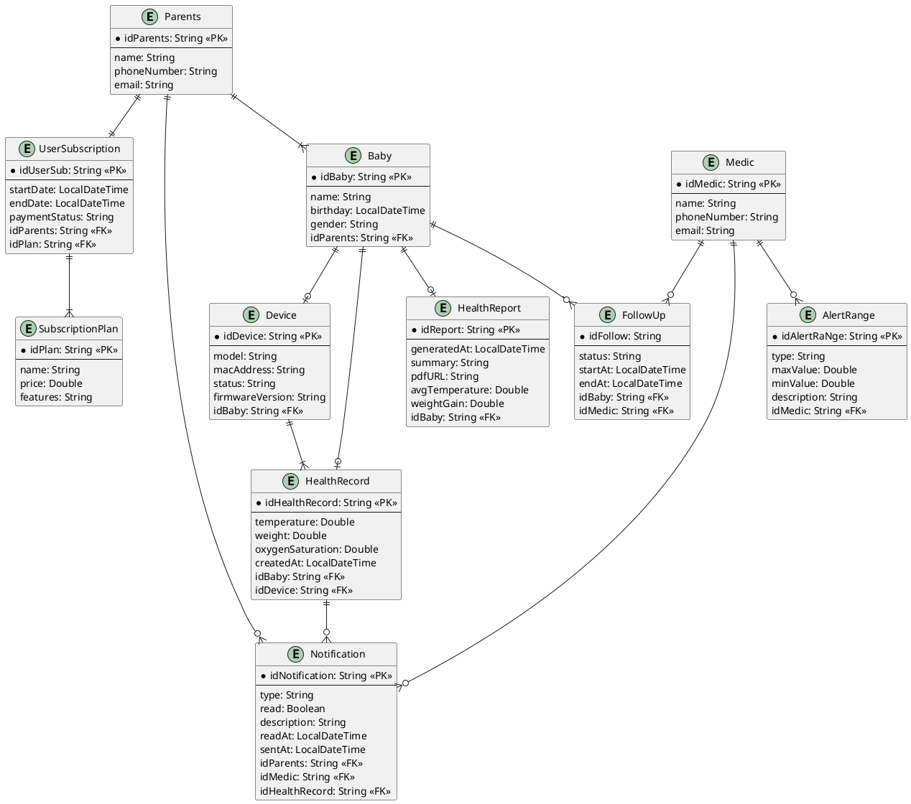

# Capítulo IV: Product Design

## 4.1. Style Guidelines

### 4.1.1. General Style Guidelines

### 4.1.2. Web Style Guidelines

## 4.2. Information Architecture

### 4.2.1. Organization Systems

### 4.2.2. Labeling Systems

### 4.2.3. SEO Tags and Meta Tags

### 4.2.4. Searching Systems

### 4.2.5. Navigation Systems

## 4.3. Landing Page UI Design

### 4.3.1. Landing Page Wireframe

### 4.3.2. Landing Page Mock-up.

## 4.4. Web Applications UX/UI Design

### 4.4.1. Web Applications Wireframes

### 4.4.2. Web Applications Wireflow Diagrams

### 4.4.3. Web Applications Mock-ups

### 4.4.4. Web Applications User Flow Diagrams

## 4.5. Web Applications Prototyping

## 4.6. Domain-Driven Software Architecture

### 4.6.1. Design-Level Event Storming

### 4.6.2. Software Architecture Context Diagram

### 4.6.3. Software Architecture Container Diagrams

### 4.6.4. Software Architecture Components Diagrams

## 4.7. Software Object-Oriented Design

### 4.7.1. Class Diagrams

## 4.8. Database Design

Antes de crear una base de datos, se debe de modelar el sistema considerando las necesidades del proyecto o negocio a realizar. La finalidad de esto es mostrar entidades, atributos y las relaciones que tienen dichas entidades (IBM, s.f.).

### 4.8.1. Database Diagram

- Descripción de entidades
    - Parents
        - Usuario y tutor legal dentro de la aplicación.
        - Un 'Parents' solamente tiene una suscripción.
        - Un 'Parents' puede monitorear 1 a muchos 'Baby'.
        - Un 'Parents' puede estar recibiendo 0 a muchas notificaciones.
    - SubscriptionPlan
        - Son todos los planes que existen en la aplicación.
    - UserSubscription
        - Es la suscripción asociada al usuario 'Parents'.
        - Necesita el plan seleccionado y al usuario que tiene el plan.
    - Baby
        - Objeto de observación.
        - Es necesario que se guarde la información del 'Parents' al que pertenece un 'Baby'.
    - Device
        - Representación del dispositivo IoT.
        - La información conseguida se debe relacionar a un 'Baby'.
    - HealthRecord
        - Registro historico de los signos vitales.
        - Guarda el 'Device' que obtiene informacion.
        - Guarda el 'Baby' al que pertenecen los 'Device'.
    - HealthReport
        - Consolidado de datos procesados para visualización en el Dashboard.
        - Facilita la interpretación de tendencias de crecimiento y salud sin necesidad de consultar registros individuales.
    - Notification
        - Encargado de mensajes para 'Parents' y 'Medic'.
        - Necesita el 'Parents' y 'Medic' que recibiran las notificaciones.
    - FollowUp
        - Entidad intermedia de 'Baby' y 'Medic'.
    - Medic
        - Usuario profesional con privilegios altos.
        - Visualiza al 'Baby' y gestiona los 'AlertRange'
    - AlertRange
        - Configuración hecha por un medico o puesta de manera estándar.