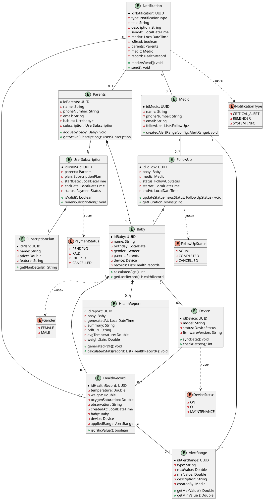
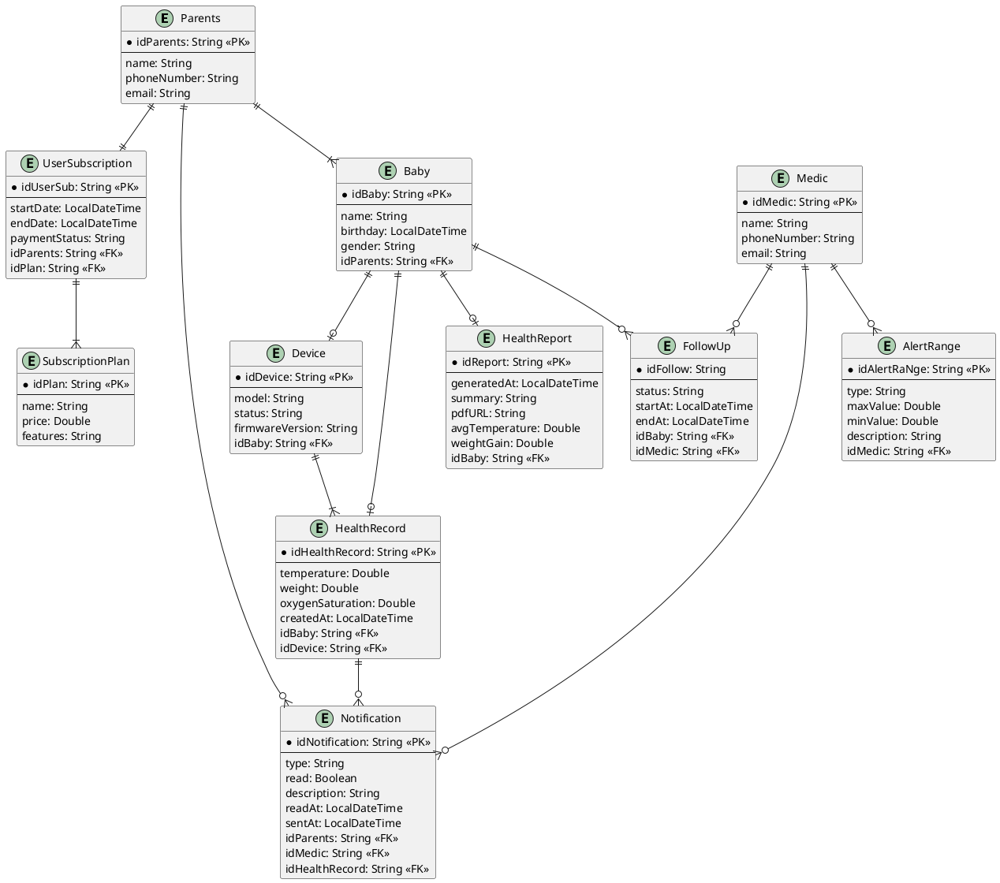

# Capítulo IV: Product Design

## 4.1. Style Guidelines

### 4.1.1. General Style Guidelines
Branding:
Para el logotipo de **SIRAN**, se ha optado por un diseño protector y clínico que refleja la seguridad de la aplicación. El logotipo se compone de una tipografía sólida y moderna, acompañada de un icono que simboliza el cuidado neonatal y el monitoreo constante, así como un escudo de protección. Los colores utilizados son tonos azules y celestes, lo que refuerza la idea de confianza, salud y tranquilidad.

### Tipografía

La tipografía de nuestra aplicación será fácilmente legible y estética. Se utilizará la fuente **Poppins** para botones y títulos, mientras que para los textos se empleará **Roboto**.

El interlineado será de **1.15**, con un tamaño base de:
- **18px** en la versión web
- **16px** en la versión móvil

### Pesos y estilos

- **Heading 1**
    - Poppins, Bold, 18px, Negro (#000000)
    - Poppins, Normal, 18px, Blanco (#FFFFFF)

- **Heading 2**
    - Poppins, Normal, 16px, Rojo (#FF0000)
    - Poppins, Normal, 16px, SkyBlue (#87CEEB)

- **Heading 3**
    - Poppins, Normal, 14px, LawnGreen (#7CFC00)

- **Texto**
    - Roboto, Bold, 11px, Rojo (#FF0000)
    - Roboto, Normal, 9px, Blanco (#FFFFFF)

### Colores

Nuestra plataforma, al estar dirigida a centros de salud y atención neonatal, utiliza una paleta cromática que transmite confianza, cuidado y profesionalismo:

- **#E3EDFF (azul lavanda pálido):** aporta calma y cercanía en testimonios.
- **#FFFFFF (blanco):** representa limpieza y orden.
- **#F2F2F2 (blanco grisáceo):** permite diferenciar secciones con sutileza.
- **#4A7FF0 (azul brillante):** resalta elementos interactivos y fomenta la interacción.
- **#000000 (negro):** asegura legibilidad y formalidad en los textos.
- **#C0EEE3 (cian pastel):** transmite bienestar y armonía.
- **#CDEBFF (celeste pastel):** refuerza la serenidad y la seguridad visual en la experiencia del usuario.

---

## Spacing

El diseño de **SIRAN** destaca por un espacio amplio y regular que sirve como eje organizador. Esta apuesta por el “aire” entre elementos mejora la claridad informativa y proyecta una imagen de orden y estabilidad, haciendo que la interacción del usuario sea mucho más cómoda.

### Escala de Espaciado (Spacing System)

- **4px:** Micro-ajustes (iconos, etiquetas pequeñas).
- **8px:** Espaciado interno entre elementos muy cercanos (título y subtítulo).
- **12px:** Espaciado entre elementos de una lista o tarjetas pequeñas.
- **16px:** Relleno (padding) interno estándar para botones y tarjetas.
- **20px:** Espaciado entre bloques de texto cortos.
- **24px:** Margen entre elementos de un mismo grupo (botones de planes).
- **32px:** Espacio entre columnas o elementos secundarios.
- **40px:** Margen superior/inferior para secciones pequeñas de contenido.
- **48px:** Separación estándar entre secciones de información (testimonios).
- **64px:** Espaciado generoso para resaltar el hero (cabecera).
- **80px:** Margen de seguridad para respiración visual en dispositivos móviles.
- **96px:** Separación amplia entre secciones principales (precios y beneficios).
- **128px:** Margen superior/inferior para secciones de alto impacto visual.
- **160px:** Espaciado máximo para secciones con mucho aire (capturas de pantalla).
- **192px:** Margen de diseño para pantallas de escritorio extra anchas.
- **256px:** Espaciado para composiciones artísticas o cierres de página.

### Tono de Comunicación y Lenguaje

Para **SIRAN**, la comunicación se sitúa en un equilibrio entre la autoridad clínica y la empatía humana:

- **Serio:** El manejo de datos vitales de bebés exige rigor absoluto, transmitiendo precisión y responsabilidad.
- **Formal:** Uso de lenguaje profesional que respete la relación médico-paciente y la institucionalidad.
- **Respetuoso:** Reconoce la vulnerabilidad y preocupación de padres y personal médico.
- **Sereno:** Transmite calma, control y seguridad en momentos de tensión.

### Sustento de Principios y Orientación del Servicio

La página está orientada como una extensión digital de la confianza clínica. Inspirada en sistemas de diseño como **Carbon Health** o **Spectrum (Adobe)**, se basa en:

- **Claridad Operativa:** Reducción del ruido visual. La información crítica (alertas y signos) debe ser legible en segundos, priorizando la jerarquía visual para evitar fatiga cognitiva.
- **Empatía Silenciosa:** Uso de espacios en blanco y paleta de azules suaves para reducir la ansiedad del usuario.
- **Accesibilidad y Confiabilidad:** Enfoque en la consistencia, asegurando que iconos y mensajes sean predecibles y claros, eliminando ambigüedades.

> **"SIRAN se presenta como un ecosistema de vigilancia silenciosa y precisa, donde la tecnología se humaniza para ofrecer paz mental a través de una comunicación directa, experta y profundamente protectora."**

### 4.1.2. Web Style Guidelines

Para SIRAN, hemos diseñado una plataforma web bajo un enfoque de Diseño Adaptable (Responsive Web Design), garantizando que el monitoreo clínico y la información de salud sean accesibles y perfectamente legibles desde cualquier dispositivo, ya sea una tablet en clínica o un smartphone para los padres.
Como equipo, hemos optado por incorporar el patrón de diseño en forma de F en nuestro sitio web. Esta técnica es ideal para páginas con carga de contenido informativo y servicios clínicos, ya que emula el comportamiento natural de lectura. Ubicamos el logotipo en la esquina superior izquierda para establecer identidad inmediata, seguido de un menú de navegación horizontal que culmina en un botón de acción (CTA) destacado en la esquina superior derecha para facilitar la conversión inmediata.

## 4.2. Information Architecture
La arquitectura de la información de SIRAN ha sido diseñada con el objetivo de organizar el contenido de manera clara, estructurada y centrada en el usuario, permitiendo una navegación intuitiva tanto para padres como para el personal médico. Esta estructura facilita el acceso rápido a información crítica relacionada con el monitoreo neonatal, reduciendo la carga cognitiva y mejorando la experiencia de uso.

### 4.2.1. Organization Systems
<table>
  <thead>
    <tr>
      <th>Tópico</th>
      <th>Definición</th>
    </tr>
  </thead>
  <tbody>
    <tr>
      <td><strong>Home</strong></td>
      <td>La página de inicio que ofrece una vista general de la clínica, destacando nuestra misión de cuidar a los más pequeños con ternura y tecnología.</td>
    </tr>
    <tr>
      <td><strong>Beneficios</strong></td>
      <td>La sección que destaca los pilares de valor del servicio, como la tecnología neonatal avanzada.</td>
    </tr>
    <tr>
      <td><strong>Testimonios</strong></td>
      <td>La sección que presenta experiencias reales de padres, brindando confianza y tranquilidad sobre la salud de sus hijos.</td>
    </tr>
    <tr>
      <td><strong>Planes</strong></td>
      <td>La sección que detalla las opciones de suscripción y niveles de atención, permitiendo comparar funciones y costos según cada necesidad.</td>
    </tr>
    <tr>
      <td><strong>Empezar</strong></td>
      <td>El botón de acción destacado que redirige al usuario para iniciar su registro o contratar el plan de salud seleccionado de inmediato.</td>
    </tr>
  </tbody>
</table>

****Seccion Planes de Suscripcion:****

<table>
  <thead>
    <tr>
      <th>Tópico</th>
      <th>Definición</th>
    </tr>
  </thead>
  <tbody>
    <tr>
      <td><strong>Catálogo de membresías</strong></td>
      <td>Este apartado presenta de forma clara todas las opciones de suscripción disponibles para el monitoreo y cuidado del bebé.</td>
    </tr>
    <tr>
      <td><strong>Especificaciones del servicio</strong></td>
      <td>Aquí se desglosan las características, coberturas y beneficios particulares que incluye cada nivel de atención de SIRAN.</td>
    </tr>
  </tbody>
</table>

****Seccion Planes de Testimonios:****

<table>
  <thead>
    <tr>
      <th>Tópico</th>
      <th>Definición</th>
    </tr>
  </thead>
  <tbody>
    <tr>
      <td><strong>Panel de experiencias</strong></td>
      <td>El sitio presentará una selección destacada con los encabezados de los testimonios más recientes compartidos por las familias.</td>
    </tr>
  </tbody>
</table>

Menú Superior Estructurado: Se implementa una barra de navegación fija y homogénea que permite al usuario desplazarse con fluidez entre los módulos clave de la plataforma sin perder el contexto.

Adaptabilidad Multiplataforma: La interfaz emplea un diseño flexible que ajusta automáticamente su composición y elementos visuales, garantizando una experiencia de uso intuitiva y funcional tanto en computadoras como en dispositivos móviles.

### 4.2.2. Labeling Systems

Para la organización de la interfaz, se ha implementado un sistema de etiquetado basado en encabezados descriptivos que agrupan lógicamente el contenido. Esta estructura permite que el usuario identifique de forma inmediata la función de cada sección, reduciendo la incertidumbre y facilitando la navegación mediante clics precisos

<table>
  <thead>
    <tr>
      <th>Tópico</th>
      <th>Definición</th>
    </tr>
  </thead>
  <tbody>
    <tr>
      <td><strong>Home</strong></td>
      <td>Punto de acceso principal y presentación de la propuesta de valor de la clínica de monitoreo neonatal.</td>
    </tr>
    <tr>
      <td><strong>Planes</strong></td>
      <td>Sección donde se detallan las coberturas, beneficios clínicos y tarifas vigentes para la suscripción al servicio.</td>
    </tr>
    <tr>
      <td><strong>Testimonios</strong></td>
      <td>Espacio dedicado a la validación social, donde se exhiben las experiencias y valoraciones de las familias atendidas.</td>
    </tr>
  </tbody>
</table>

### 4.2.3. SEO Tags and Meta Tags

Para **SIRAN**, las meta etiquetas son fundamentales para garantizar que nuestra plataforma de monitoreo sea indexada correctamente por los motores de búsqueda, permitiendo que las familias y clínicas nos encuentren bajo criterios de seguridad y cuidado infantil. Estas etiquetas optimizan el análisis de nuestro código HTML y fortalecen la autoridad digital del proyecto.

*   **Título (Title Tag):** Representa el nombre principal de la página que aparece en las pestañas del navegador y resultados de búsqueda.

    *   _Definición:_ "SIRAN | Monitoreo Neonatal Inteligente y Cuidado Pediátrico"

    *   _Objetivo:_ Captar la atención mediante una promesa de valor clara y profesional.

*   **Codificación de caracteres (Charset):** Se ha implementado el estándar UTF-8.

    *   _Justificación técnica:_ Garantiza la visualización correcta de caracteres especiales (como tildes y eñes) propios del idioma español, optimizando además el uso de memoria para los navegadores y asegurando que el contenido clínico se lea sin errores en cualquier región.

*   **Descripción (Meta Description):** Esta etiqueta ofrece un resumen ejecutivo del servicio.

    *   _Contenido:_ "Cuidamos de los más pequeños con ternura y tecnología avanzada. Descubre nuestro sistema de monitoreo neonatal con alertas en tiempo real y atención pediátrica experta."

    *   _Objetivo:_ Comunicar confianza al usuario.

*   **Palabras clave (Keywords):** Se han seleccionado términos estratégicos de alta relevancia para nuestro nicho.

    *   _Términos:_ monitoreo neonatal, salud infantil, tecnología médica, clínica pediátrica, alertas médicas, SIRAN, cuidado del bebé.

*   **Autor y derechos de autor (Author & Copyright):** Se utiliza para registrar la propiedad intelectual del software y la autoría del equipo de desarrollo.

    *   _Responsables:_ Establece a **"Equipo SIRAN"** como los responsables legales y creativos del contenido y la plataforma.

### 4.2.4. Searching Systems

El motor de búsqueda de SIRAN es una herramienta crítica diseñada para que los padres y el personal médico localicen servicios, especialistas o información de salud de manera inmediata y precisa.

- Búsqueda por Necesidad Clínica: Los usuarios podrán realizar búsquedas basadas en el estado o requerimiento del lactante, ya sea para monitoreo preventivo, consultas de nutrición neonatal o seguimiento de signos vitales.

- Búsqueda por Especialidad: Permite localizar profesionales de la salud por su área de experticia específica, tales como: neonatología, cardiología pediátrica, especialistas en lactancia o urgencias pediátricas.

- Resultados de Alta Relevancia: El sistema prioriza los resultados basándose en la urgencia y el historial de salud del paciente, ordenando la información de manera que las soluciones más críticas o mejor valoradas aparezcan en primer lugar.

### 4.2.5. Navigation Systems

El **Sistema de Navegación** constituye el marco estructural que garantiza un desplazamiento intuitivo y fluido de los usuarios a través de los diversos módulos y pantallas de la plataforma. Su diseño está orientado a minimizar el número de clics necesarios para acceder a la información crítica del paciente.

 * **Jerarquía de Navegación:** El sistema se organiza mediante las siguientes secciones fundamentales, integradas de forma persistente en la barra de navegación superior para asegurar una orientación constante dentro del ecosistema digital.

*   Home

*   Beneficios

*   Testimonios

*   Planes

## 4.3. Landing Page UI Design

### 4.3.1. Landing Page Wireframe

### 4.3.2. Landing Page Mock-up.

## 4.4. Web Applications UX/UI Design

### 4.4.1. Web Applications Wireframes

### 4.4.2. Web Applications Wireflow Diagrams

### 4.4.3. Web Applications Mock-ups

### 4.4.4. Web Applications User Flow Diagrams

## 4.5. Web Applications Prototyping

## 4.6. Domain-Driven Software Architecture

### 4.6.1. Design-Level Event Storming

### 4.6.2. Software Architecture Context Diagram

### 4.6.3. Software Architecture Container Diagrams

### 4.6.4. Software Architecture Components Diagrams

## 4.7. Software Object-Oriented Design

El Diseño de Software Orientado a Objetos (OOD) es una metodología que busca la definición de los objetos y la manera que se relaciona con otros objetos, con la finalidad de mantener un diseño coherente y eficiente, al momento de escalar (Schmidt, 2018).

### 4.7.1. Class Diagrams

## 4.8. Database Design

Antes de crear una base de datos, se debe de modelar el sistema considerando las necesidades del proyecto o negocio a realizar. La finalidad de esto es mostrar entidades, atributos y las relaciones que tienen dichas entidades (IBM, s.f.).

### 4.8.1. Database Diagram

- Descripción de entidades
    - Parents
        - Usuario y tutor legal dentro de la aplicación.
        - Un 'Parents' solamente tiene una suscripción.
        - Un 'Parents' puede monitorear 1 a muchos 'Baby'.
        - Un 'Parents' puede estar recibiendo 0 a muchas notificaciones.
    - SubscriptionPlan
        - Son todos los planes que existen en la aplicación.
    - UserSubscription
        - Es la suscripción asociada al usuario 'Parents'.
        - Necesita el plan seleccionado y al usuario que tiene el plan.
    - Baby
        - Objeto de observación.
        - Es necesario que se guarde la información del 'Parents' al que pertenece un 'Baby'.
    - Device
        - Representación del dispositivo IoT.
        - La información conseguida se debe relacionar a un 'Baby'.
    - HealthRecord
        - Registro historico de los signos vitales.
        - Guarda el 'Device' que obtiene informacion.
        - Guarda el 'Baby' al que pertenecen los 'Device'.
    - HealthReport
        - Consolidado de datos procesados para visualización en el Dashboard.
        - Facilita la interpretación de tendencias de crecimiento y salud sin necesidad de consultar registros individuales.
    - Notification
        - Encargado de mensajes para 'Parents' y 'Medic'.
        - Necesita el 'Parents' y 'Medic' que recibiran las notificaciones.
    - FollowUp
        - Entidad intermedia de 'Baby' y 'Medic'.
    - Medic
        - Usuario profesional con privilegios altos.
        - Visualiza al 'Baby' y gestiona los 'AlertRange'
    - AlertRange
        - Configuración hecha por un medico o puesta de manera estándar.