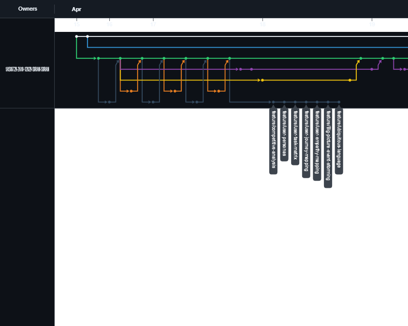
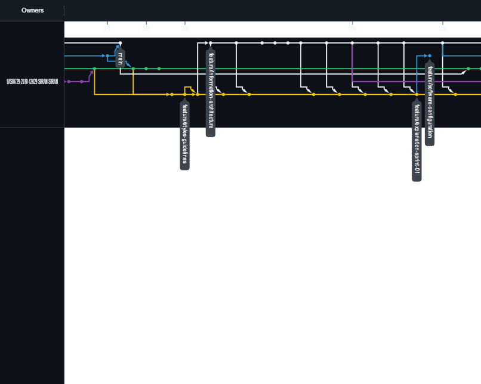
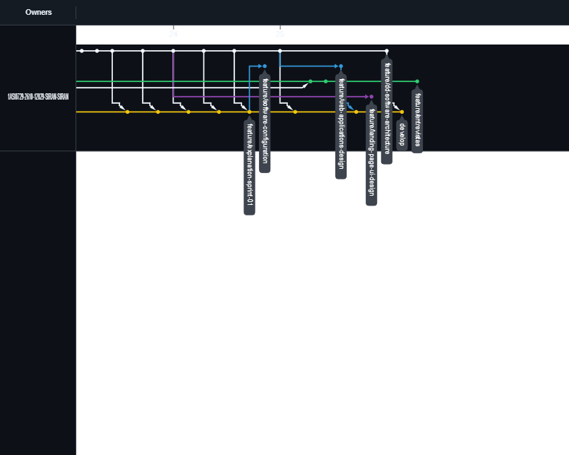
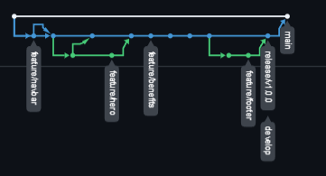
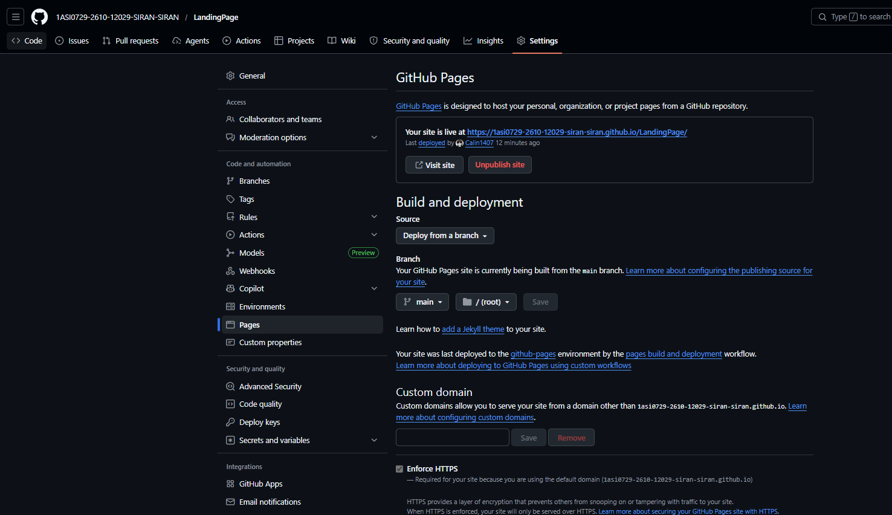
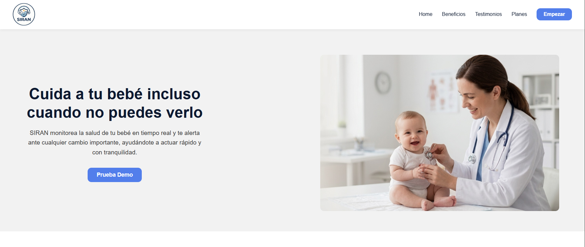
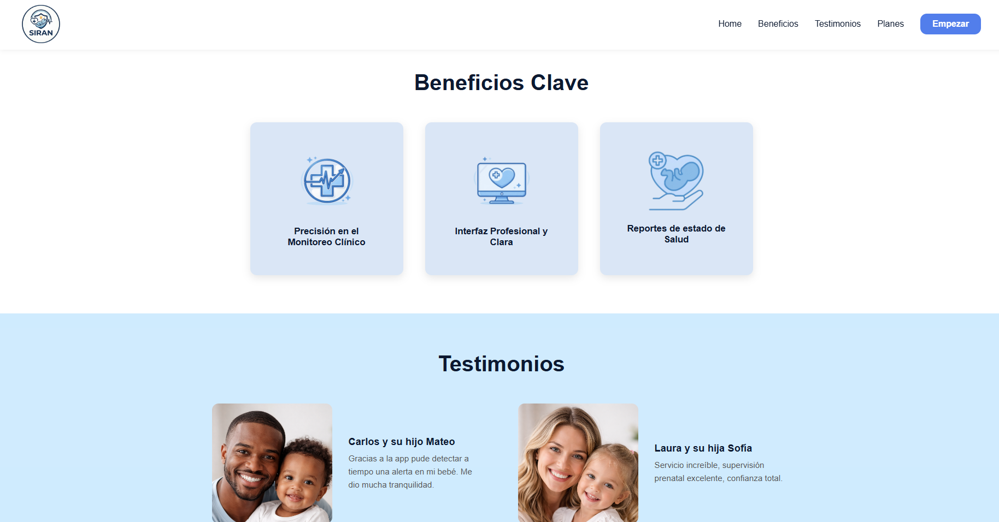
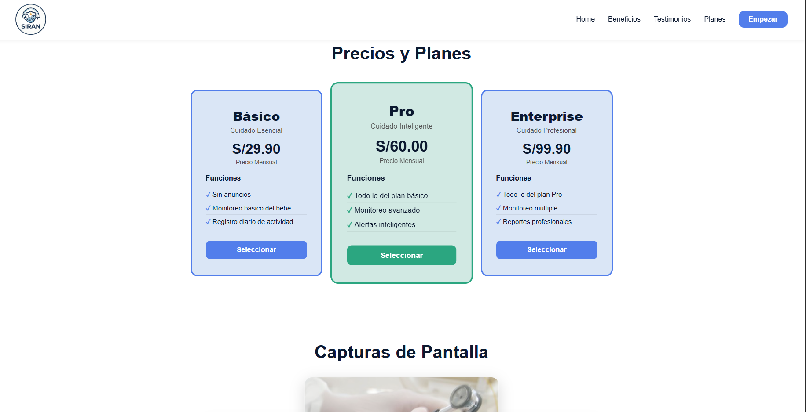
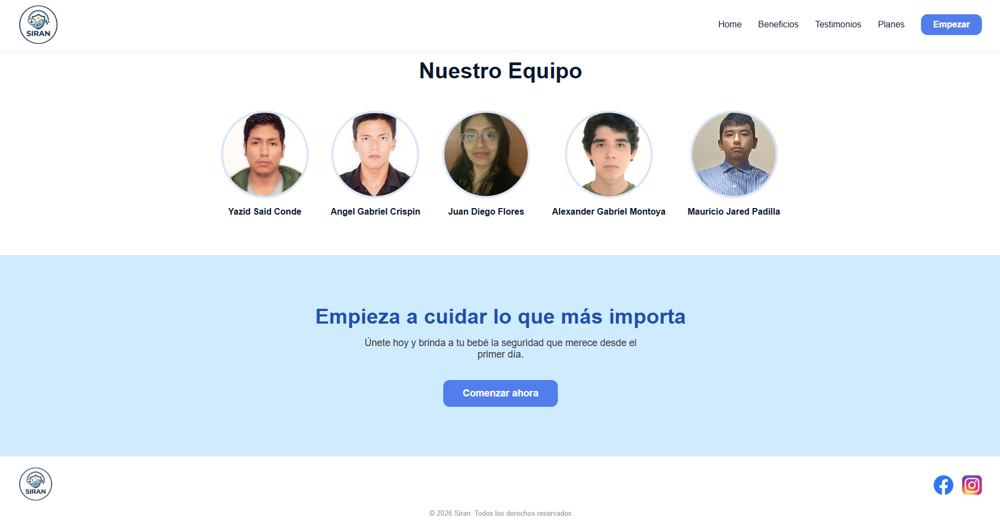

# Capítulo V: Product Implementation, Validation & Deployment

## 5.1. Software Configuration Management

### 5.1.1. Software Development Environment Configuration

### 5.1.2. Source Code Management

### 5.1.3. Source Code Style Guide & Conventions

### 5.1.4. Software Deployment Configuration

## 5.2. Landing Page, Services & Applications Implementation

### 5.2.1. Sprint 1

#### 5.2.1.1. Sprint Planning 1

<table border="1" style="border-collapse:collapse">
  <thead>
    <tr>
      <th>Sprint #</th>
      <th>Sprint 1</th>
    </tr>
  </thead>
  <tbody>
    <tr>
      <td colspan="2"><b>Sprint Planning Background</b></td>
    </tr>
    <tr>
      <td><b>Date</b></td>
      <td>09/04/2026</td>
    </tr>
    <tr>
      <td><b>Time</b></td>
      <td>5:00 pm</td>
    </tr>
    <tr>
      <td><b>Location</b></td>
      <td>remota</td>
    </tr>
    <tr>
      <td><b>Prepared By</b></td>
      <td>Retuerto Rodríguez, Jorge Manuel</td>
    </tr>
    <tr>
      <td><b>Attendees (to planning meeting)</b></td>
      <td>Mendoza Moreano, Mariel Lucero - Palomino Vilcañaupa, Daril Johan - Said Conde, Yazid - Véliz Martínez, Diego Alonso</td>
    </tr>
    <tr>
      <td><b>Sprint n – 1 Review Summary</b></td>
      <td>-</td>
    </tr>
    <tr>
      <td><b>Sprint n – 1 Retrospective Summary</b></td>
      <td>-</td>
    </tr>
    <tr>
      <td colspan="2"><b>Sprint Goal & User Stories</b></td>
    </tr>
    <tr>
      <td><b>Sprint n Goal</b></td>
      <td>Lectura del documento de 'Conventional Commits' y GitFlow. Desglose del trabajo en 5 capítulos, división de trabajo entre miembros y asignación de roles</td>
    </tr>
    <tr>
      <td><b>Sprint n Velocity</b></td>
      <td>10</td>
    </tr>
    <tr>
      <td><b>Sum of Story Points</b></td>
      <td>15</td>
    </tr>
  </tbody>
</table>

 

<table border="1" style="border-collapse:collapse">
  <thead>
    <tr>
      <th>Sprint #</th>
      <th>Sprint 1</th>
    </tr>
  </thead>
  <tbody>
    <tr>
      <td colspan="2"><b>Sprint Planning Background</b></td>
    </tr>
    <tr>
      <td><b>Date</b></td>
      <td>15/04/2026</td>
    </tr>
    <tr>
      <td><b>Time</b></td>
      <td>2:00 pm</td>
    </tr>
    <tr>
      <td><b>Location</b></td>
      <td>remota</td>
    </tr>
    <tr>
      <td><b>Prepared By</b></td>
      <td>Retuerto Rodríguez, Jorge Manuel</td>
    </tr>
    <tr>
      <td><b>Attendees (to planning meeting)</b></td>
      <td>Mendoza Moreano, Mariel Lucero - Palomino Vilcañaupa, Daril Johan - Said Conde, Yazid - Véliz Martínez, Diego Alonso</td>
    </tr>
    <tr>
      <td><b>Sprint n – 1 Review Summary</b></td>
      <td>Se consiguió grandes avances respecto al reporte, siendo el más importante el desarrollo de los Wireframes y MockUp del Landing Page.</td>
    </tr>
    <tr>
      <td><b>Sprint n – 1 Retrospective Summary</b></td>
      <td>Debido a malas prácticas en la creación de ramas e incumplimiento de los 'Conventional Commits' se decidio reiniciar el repositorio y capacitar a los miembros.</td>
    </tr>
    <tr>
      <td colspan="2"><b>Sprint Goal & User Stories</b></td>
    </tr>
    <tr>
      <td><b>Sprint n Goal</b></td>
      <td>Meta del sprint 1, reunión 02, desarrollo de Landing Page ofreciendo reseñas y descripciones necesarias para que el usuario válide, en primer vista, el producto.</td>
    </tr>
    <tr>
      <td><b>Sprint n Velocity</b></td>
      <td>10</td>
    </tr>
    <tr>
      <td><b>Sum of Story Points</b></td>
      <td>10</td>
    </tr>
  </tbody>
</table>

#### 5.2.1.2. Aspect Leaders and Collaborators

<table border="1" style="border-collapse:collapse">
<thead>
<tr>
<th>Team Members</th>
<th>GitHub Username</th>
<th>Landing Page</th>
<th>Interviews</th>
<th>MockUps & Wireframes</th>
<th>Organization</th>
</tr>
</thead>
<tbody>
<tr>
<td>Mendoza Moreano, Mariel Lucero</td>
<td>MarielLucero</td>
<td>C</td>
<td>C</td>
<td>C</td>
<td>C</td>
</tr>
<tr>
<td>Palomino Vilcañaupa, Daril Johan</td>
<td>Daril19</td>
<td>C</td>
<td>C</td>
<td>L</td>
<td>C</td>
</tr>
<tr>
<td>Retuerto Rodriguez, Jorge Manuel</td>
<td>Calin1407</td>
<td>C</td>
<td>C</td>
<td>C</td>
<td>L</td>
</tr>
<tr>
<td>Said Conde, Yazid</td>
<td>BL4Z3K4D</td>
<td>L</td>
<td>C</td>
<td>C</td>
<td>L</td>
</tr>
<tr>
<td>Véliz Martínez, Diego Alonso</td>
<td>Veliz-0912</td>
<td>C</td>
<td>L</td>
<td>C</td>
<td>C</td>
</tr>
</tbody>
</table>

#### 5.2.1.3. Sprint Backlog 1

<table border="1" style="border-collapse:collapse">
    <tr>
        <th colspan="8">Sprint #</th>
        <th colspan="8">Sprint 1</th>
    </tr>
    <tr>
        <th colspan="2">User Story</th>
        <th colspan="6">Work-Item / Task</th>
        <th rowspan="2">Status (To-do / In-Process / To-Review / Done)</th>
    </tr>
    <tr>
        <th>Id</th>
        <th>Title</th>
        <th>Id</th>
        <th>Title</th>
        <th>Description</th>
        <th>Estimation (Hours)</th>
        <th>Assigned To</th>
    </tr>
    <tr>
        <td>07</td>
        <td>Registrarse en la plataforma</td>
        <td>01</td>
        <td>Registrarse en la plataforma</td>
        <td>Como padre o neonatólogo, quiero registrarme en la plataforma para crear una cuenta y acceder a las funcionalidades de SIRAN.</td>
        <td>4</td>
        <td>Said Conde, Yazid</td>
        <td></td>
        <td>In-Process</td>
    </tr>
    <tr>
        <td>09</td>
        <td>Visualizar beneficios de la plataforma</td>
        <td>02</td>
        <td>Visualizar beneficios de la plataforma</td>
        <td>Como visitante, quiero conocer los beneficios principales de SIRAN para decidir si registrarme.</td>
        <td>2</td>
        <td>Said Conde, Yazid</td>
        <td></td>
        <td>Done</td>
    </tr>
    <tr>
        <td>11</td>
        <td>Visualizar testimonios y casos de uso</td>
        <td>03</td>
        <td>Visualizar testimonios y casos de uso</td>
        <td>Como visitante del segmento padre primerizo, quiero ver testimonios o casos de uso reales para generar confianza en la herramienta.</td>
        <td>2</td>
        <td>Said Conde, Yazid</td>
        <td></td>
        <td>Done</td>
    </tr>
    <tr>
        <td>13</td>
        <td>Visualizar planes disponibles de la plataforma</td>
        <td>04</td>
        <td>Visualizar planes disponibles de la plataforma</td>
        <td>Como visitante, quiero visualizar los planes de suscripción disponibles para evaluar cuál se adapta mejor a mis necesidades.</td>
        <td>3</td>
        <td>Said Conde, Yazid</td>
        <td></td>
        <td>Done</td>
    </tr>
    <tr>
        <td>17</td>
        <td>Visualizar interfaz adaptativa</td>
        <td>04</td>
        <td>Diseño Responsive</td>
        <td>Como visitante, quiero que la landing page se adapte a mi dispositivo móvil para navegar cómodamente desde cualquier lugar.</td>
        <td>4</td>
        <td>Said Conde, Yazid</td>
        <td></td>
        <td>Done</td>
    </tr>
    <tr>
        <td>19</td>
        <td>Navegación por anclas</td>
        <td>05</td>
        <td>Navegación por anclas</td>
        <td>Como visitante, quiero navegar por las secciones de la landing desde el menú principal para acceder rápido a la información.</td>
        <td>1</td>
        <td>Said Conde, Yazid</td>
        <td></td>
        <td>Done</td>
    </tr>
</table>

 

<table border="1" style="border-collapse:collapse">
    <tr>
        <th colspan="8">Sprint #</th>
        <th colspan="8">Sprint 1</th>
    </tr>
    <tr>
        <th colspan="2">Technical Story</th>
        <th colspan="6">Work-Item / Task</th>
        <th rowspan="2">Status (To-do / In-Process / To-Review / Done)</th>
    </tr>
    <tr>
        <th>Id</th>
        <th>Title</th>
        <th>Id</th>
        <th>Title</th>
        <th>Description</th>
        <th>Estimation (Hours)</th>
        <th>Assigned To</th>
    </tr>
    <tr>
        <td>06</td>
        <td>Definición de Modelo de Negocio y alcance</td>
        <td>01</td>
        <td>Capítulo 1 del informe de SIRAN</td>
        <td>Como Developer quiero definir el modelo de negocio y el alcance completo del proyecto SIRAN para que el equipo cuente con una base alineada con los objetivos del producto antes de iniciar el desarrollo técnico.</td>
        <td>2</td>
        <td>Said Conde, Yazid</td>
        <td></td>
        <td>DONE</td>
    </tr>
    <tr>
        <td>07</td>
        <td>Análisis de Necesidades y Realidad del Usuario</td>
        <td>02</td>
        <td>Capítulo 2 del informe de SIRAN</td>
        <td>Como Developer, quiero documentar el análisis de necesidades y la realidad del usuario para que el equipo tenga claridad sobre el problema, los usuarios afectados y los requisitos prioritarios antes de diseñar la arquitectura técnica.</td>
        <td>4</td>
        <td>Véliz Martínez, Diego Alonso</td>
        <td></td>
        <td>DONE</td>
    </tr>
    <tr>
        <td>08</td>
        <td>Especificación de Requisitos</td>
        <td>03</td>
        <td>Capítulo 3 del informe de SIRAN</td>
        <td>Como Developer, quiero especificar los requisitos funcionales y no funcionales del sistema para contar con una base clara que guíe el desarrollo del producto.</td>
        <td>6</td>
        <td>Said Conde, Yazid    Mendoza Moreano, Mariel Lucero</td>
        <td></td>
        <td>DONE</td>
    </tr>
    <tr>
        <td>09</td>
        <td>Diseño de Producto</td>
        <td>04</td>
        <td>Capítulo 4 del informe de SIRAN</td>
        <td>Como Developer, quiero diseñar la arquitectura y la experiencia del producto para definir cómo funcionará el sistema antes de su implementación.</td>
        <td>8</td>
        <td>Palomino Vilcañaupa, Daril Johan</td>
        <td></td>
        <td>DONE</td>
    </tr>
    <tr>
        <td>10</td>
        <td>Implementación de Producto, Validación y Deploy</td>
        <td>05</td>
        <td>Capítulo 5 del informe de SIRAN</td>
        <td>Como Developer, quiero implementar, validar y desplegar el sistema para asegurar su funcionamiento y disponibilidad para los usuarios finales.</td>
        <td>3</td>
        <td>Retuerto Rodriguez, Jorge Manuel</td>
        <td></td>
        <td>DONE</td>
    </tr>
</table>

#### 5.2.1.4. Development Evidence for Sprint Review

La siguiente tabla presenta una selección de las contribuciones más significativas realizadas durante este sprint. Estas entradas representan hitos clave y prácticas seguidas entre los desarrolladores en el desarrollo del proyecto, incluyendo la estructuración de la documentación, solución de los Technical Stories y las correcciones críticas, lo que proporciona una clara evidencia del progreso del equipo y su adhesión al flujo de trabajo establecido.

<table border="1" style="border-collapse:collapse">
<tr>
<th>Repository</th>
<th>Branch</th>
<th>Commit Id</th>
<th>Commit Message</th>
<th>Commited on Date</th>
</tr>
<tr>
<td>Calin1407/1ASI0729-2610-12029-SIRAN-SIRAN/upc-pre-202610-1asi0729-12029-SIRAN-report</td>
<td>main</td>
<td>83eb0bf3d9a9e2c32068215e47b64baabd86ce59</td>
<td>docs: a documentation report was created</td>
<td>15/04/2026</td>
</tr>
<tr>
<td>BL4Z3K4D/1ASI0729-2610-12029-SIRAN-SIRAN/upc-pre-202610-1asi0729-12029-SIRAN-report</td>
<td>feature/startup-profile</td>
<td>4dfbbe9a3e745f267900b40a426ae613a70c728a</td>
<td>docs(): add content to startup about and profile integrants</td>
<td>16/04/2026</td>
</tr>
<td>Calin1407/1ASI0729-2610-12029-SIRAN-SIRAN/upc-pre-202610-1asi0729-12029-SIRAN-report</td>
<td>hotfix/restructure-metadata-yaml</td>
<td>eb6de63ad10a57693eb640ea9a4d89257b10f8ee</td>
<td>fix: restructure metadata.yaml for PDF engine compatibility</td>
<td>21/04/2026</td>
<tr>
<td>Daroh19/1ASI0729-2610-12029-SIRAN-SIRAN/upc-pre-202610-1asi0729-12029-SIRAN-report</td>
<td>feature/dd-software-architecture</td>
<td>6ec1e219a0113b1a486e73ba63be18e8e0a99ab6</td>
<td>docs(dd-software-architecture): update chapter 04 with detailed descriptions of bounded contexts.</td>
<td>24/04/2026</td>
</tr>
</table>

Debido a las limitaciones presentes en el documento, se prefirió no documentar todo el historial de contribuciones de los miembros. Asimismo, se recomienda visualizar el historial armado por GitHub en el Anexo 3.

#### 5.2.1.5. Execution Evidence for Sprint Review

Registro de evidencia de ramas de trabajo en Report:

La evidencia del trabajo de ramas presenta una desactualización en el progreso, pues GitHub renderiza el gráfico de avance dejando de 24 a 48 horas. Se recomienda ver la rama actualizada usando el vínculo que se encuentra en el Anexo 3.

Registro de evidencia de ramas de trabajo en Landing Page:

Se visualiza un fallo en gráfico generado por GitHub, pues, sí, hicimos un *checkout* desde develop. Sin embargo, el merge no fue de develop a main, sino de release/v1.0.0 dentro de main, como exige el documento.

#### 5.2.1.6. Services Documentation Evidence for Sprint Review

Para este cierre del Sprint 1, nuestra evidencia se estructura en dos pilares: en Trello se detalla el estado del Product Backlog con las prioridades actualizadas y el flujo de historias terminadas. Por su parte, en Figma se presenta el incremento de valor mediante un prototipo funcional que integra los criterios de aceptación. Para acceder a los enlaces, dirigirse al Anexo 4.

#### 5.2.1.7. Software Deployment Evidence for Sprint Review

Evidencias del Deploy de nuestra Landing Page:

#### 5.2.1.8. Team Collaboration Insights during Sprint

El equipo, bajo el liderazgo de Jorge Retuerto, demostró una alta cohesión utilizando GitHub, implementando GitFlow, para la gestión de tareas y el seguimiento del
backlog. La comunicación fue fluida a través de Meet y Discord, canales donde se resolvieron bloqueos técnicos relacionados con el diseño visual y las
validaciones de datos. Se fomentó un ambiente de apoyo mutuo, donde cada integrante contribuyó a la revisión del código de sus compañeros,
asegurando que el entregable final cumpla con los estándares de calidad del proyecto.